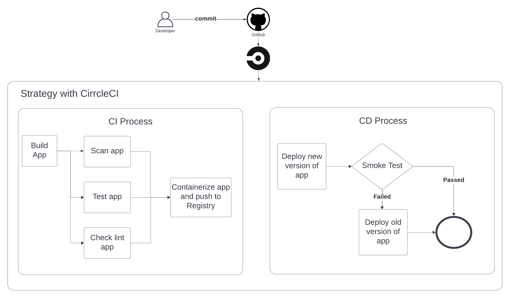

# Udacity - Cloud DevOps Engineer - Capstone

## Proposal

Use AWS with CloudFormation, KES for infrastructure
Use CircleCI for CICD Pipeline

## Prerequisites

You must install docker and k8s in local

## How to run

### Local

Build docker image:

> docker build -f docker/Dockerfile . -t namnn10/udacity-capstone

Deploy to local cluster:

> kubectl apply -f k8s/local

Forwarding port to localhost:8080:

> kubectl port-forward service/uda-app-service 8080:80

### AWS

For AWS CICD pipeline with CircleCI we will need setup infrastructure first:

Create network infrastructure

> ./scripts/deploy-network.sh create

Create cluster infrastructure (EKS):

> ./scripts/deploy-cluster.sh create

## Project Document

You can see my project quick view [here](./docs/WORKFLOW_OF_PROJECT.md)

## Reference

I created a source for this app that was linked to https://github.com/Yvad60/blog-code-references/tree/setup-jest-and-react-testing-library
