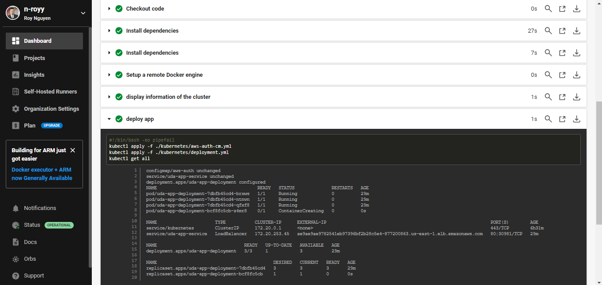

## Project quick view

# Centralized image repo

# Code is checked against a linter as part of a Continuous Integration step

# The project takes a Dockerfile and creates a Docker container in the pipeline

# The cluster has been deployed in CloudFormation

# The project performs the correct steps to do a green into the environment selected. Submit the following screenshots as evidence of the successful completion of chosen deployment methodology:

# Screenshot of the kubectl command output showing that the deployment is successful

# Screenshot showing that you can access the application after deployment.

